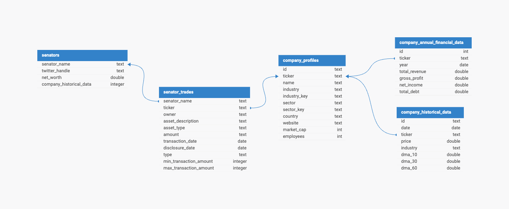

# Instructions for running pipeline locally
1. Create a database called `ticker_data` and ensure that postgres is running your machine
2. Run `git checkout main` and do a `git pull`
3. Create a `.env`  file in your project root - you can copy the `template.env` file and adjust the values as needed based on your local environment

## From here, you can either:
 - activate your conda environment and run `pip install -r requirements.txt` from the project root, then run `make run`
 - make sure docker is running, and run `docker compose up` from the project root

## Senator Trades ERD 

https://erdlab.page.link/Ev1iTFbY6eSBKgfZ9

## Available tables are:
- `company_profiles`
- `company_historical_data`
- `companny_annual_financial_data`
- `senators`
- `senator_trades`

## Available views:
- `top_senator_losses_from_purchases`
- `top_senator_losses_from_sales`
- `top_senator_gains_from_purchases`
- `top_senator_gains_from_sales`
- `senator_trades_view`
- `top_industries_view`
- `company_metrics_view`

## Extraction method:

### There are two general methods utilized in the project.
    1- Yahoo! Finance library yf.Tickers method
    2- Senate Stock Watcher Data

### Yahoo! Finance library yf.Tickers method: 

- The yfinance library's yf.Tickers method is used to fetch data for multiple tickers in a single API call. 
        
        Using yf.Tickers to fetch data for multiple tickers at once
        stocks = yf.Tickers(tickers)

- Fetching Financial Data: For each ticker, financial statements and balance sheet data are retrieved using the financials and balance_sheet attributes, respectively. These attributes return dataframes containing historical data.

- Key financial metrics such as total revenue, gross profit, net income, and total debt are extracted from the combined dataframe. These metrics are stored in a new dataframe, which is appended to a list.

- Final Dataframe Construction:  Once all tickers have been processed, the list of dataframes is concatenated into a single dataframe, which is returned as the output.

### Senate Stock Watcher data extraction method: 
- The data extraction is designed to retrieve, process, and transform data from a publicly available JSON endpoint that contains information about senator trades. 

- This method accesses the data from a public URL: https://senate-stock-watcher-data.s3-us-west-2.amazonaws.com/aggregate/all_transactions.json.
This URL points to a JSON file hosted on Amazon S3 that contains aggregated data on all senator trades.

- To access the data, the extraction function makes an HTTP GET request to the URL using the requests.get() method.  Then it checks the response status code to ensure that the request was successful (status code 200).
    - If the request is successful, the function parses the JSON content from the response using response.json().  The parsed JSON data is then normalized into a pandas DataFrame using pd.json_normalize(json_data).
    - Subsequently, the data is processed to select desired columns, columns are renamed and the records are cleans replacing unwanted values and missing key data.
- This approach ensures the data is retrieved effectively, processsed into a structured format, and cleansed for further processing, anslysis and storage into the postgres database.

## Load method:

This project includes functions to load various types of financial data into a PostgreSQL database using SQLAlchemy. The data is extracted from the Yahoo Finance API and other sources, processed into pandas DataFrames, and then loaded into corresponding database tables. Each function is responsible for loading a specific type of data.

Functions
- load_company_profiles
- load_company_historical_data
- load_senator_trades
- load_company_financials
- Function Descriptions
- load_company_profiles:

Each of the above functions loads respective information into their equivalent target table in the database.
    - Parameters: df (pandas DataFrame): The DataFrame containing company profile data.
    - engine (SQLAlchemy Engine): The database engine used to connect to the PostgreSQL database.
    - Process: The function prints the first five rows of the DataFrame for verification and then inserts the data into the respective table using the to_sql method from pandas.

## Transformations:
Transformations are performed on the extracted financial data before it is loaded into a PostgreSQL database. 
    
- SQL Based transformations run via Python: These transformations include creating and altering database tables as required. These transformations are executed using SQL scripts that are run within the Python environment.
    - Transformation Functions:
        - (a) create_annual_company_data_table: Creates the annual_company_data table in the PostgreSQL database.  Leverages the Parameters:
            - db_conn_data (dict): A dictionary containing database connection details
            - The process builds the file path to the SQL script seed_annual_company_data_table.sql located in the data/jobs directory.
            - Reads the SQL script from the file.
            - Executes the SQL script using the enact_db_transaction function to create the annual_company_data table in the database.

        - (b) run_transformations:
            - Applies additional transformations to the database schema, modifying existing tables to add new columns.
            Parameters:
                - db_conn_data (dict): A dictionary containing database connection details
                - The process builds the file path to the SQL script 002_alter_senator_trades_add_transaction_columns.sql located in the data/migrations directory.
                - Reads the SQL script from the file.
                - Executes the SQL script using the enact_db_transaction function to alter the senator_trades table and add new transaction-related columns.

- Python based transformations for data enrichment with calculated metrics : These functions are designed to process and prepare financial data extracted from Yahoo Finance and public senator trade data. The processed data is then loaded into a PostgreSQL database for further analysis. This approach ensures that the data is clean, structured, and enriched with calculated metrics.
    - Transformation functions 
        - (a) extract_senator_trades: Extracts senator trades data from a public JSON source and transforms it into a structured pandas DataFrame.
            - Fetches data from a URL.
            - Normalizes the JSON data into a DataFrame.
            - Selects relevant columns and renames them.
            - Replaces 'N/A' values in the 'ticker' column with NaN and drops rows with NaN tickers.

        - (b)extract_company_historical_data: Extracts historical stock price data for multiple tickers using the Yahoo Finance API and calculates moving averages.
            - Uses yf.Tickers to fetch data for multiple tickers at once.
            - Iterates over each ticker to extract historical stock price data within a specified date range.
            - Calculates the daily moving averages (DMA): 
                - 10-day (column: dma_10) 
                - 30-day (column: dma_30) 
                - 60-day (column: dma_60) 
            - Compiles the extracted data into a DataFrame and ultimately the load function loads the databse table company_historical_data.

## Test coverage:

## Logging method:

## Containerization:

## Senator Trades Data Flow Diagram (Draft)

https://app.diagrams.net/#G1wDjpTDYxj51aHuueRH9gTCO02O7cBWtF#%7B%22pageId%22%3A%22iDdZBAZlwHdS2ixmJFMn%22%7D

